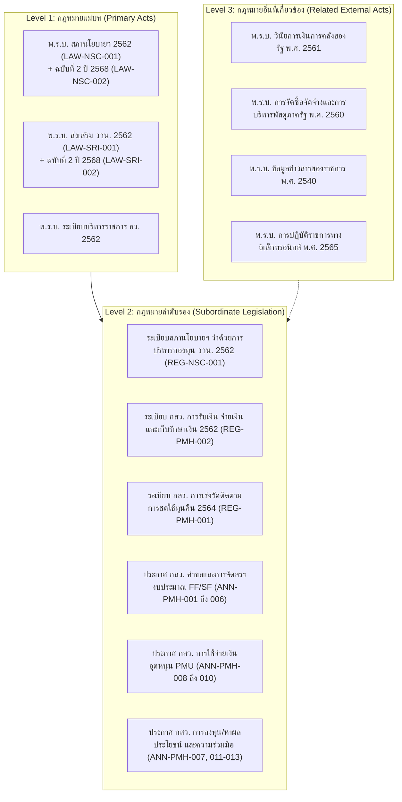

# รายงานผลการศึกษาและวิเคราะห์ความเกี่ยวพันของ พ.ร.บ. กับภารกิจหน้าที่ของ สกสว.
## โครงการศึกษา วิเคราะห์ และพัฒนาองค์ความรู้ด้านกฎหมาย ระเบียบ และแนวปฏิบัติ สกสว.
**รหัสเอกสาร:** `DOC-LEGAL-MAPPING-001` | **หมวดงาน:** `06.02 Legal Mapping` (ตาม TOR ข้อ 4.3.1)  
**แหล่งข้อมูลอ้างอิงหลัก:** [📁 โฟลเดอร์ Google Drive 4.3.1 เอกสารการวิเคราะห์จากฝ่ายวิชาการ](https://drive.google.com/drive/folders/1hfMPYkzRQlfuFq9ARDwS0_kFfMNk76Cq?usp=drive_link)  
**คณะทำงานผู้จัดทำ:** ฝ่ายที่ปรึกษาวิชาการและกฎหมาย ร่วมกับ ฝ่ายบริหารโครงการ (WS02/WS05)  
**วันที่ปรับปรุงล่าสุด:** 8 ตุลาคม 2569 | **สถานะ:** `UNDER_REVIEW / DRAFT v1.0`

---

## 1. บทนำและวัตถุประสงค์ (Executive Summary)

รายงานฉบับนี้จัดทำขึ้นจากการศึกษาและวิเคราะห์ความเกี่ยวพันระหว่าง **พระราชบัญญัติแม่บทและกฎหมายลำดับรอง** กับ **ภารกิจหน้าที่และอำนาจตามกฎหมายของสำนักงานคณะกรรมการส่งเสริมวิทยาศาสตร์ วิจัยและนวัตกรรม (สกสว.)** และคณะกรรมการส่งเสริมวิทยาศาสตร์ วิจัยและนวัตกรรม (กสว.) เพื่อส่งมอบตามขอบเขตของข้อกำหนดจ้าง (TOR) ข้อ 4.3.1

การศึกษานี้บูรณาการผลการถอดบทบัญญัติกฎหมายจำนวน 20 ฉบับ (195 ข้อกำหนด - Legal Requirements) โดยคณะที่ปรึกษาฝ่ายวิชาการและกฎหมาย ได้แก่:
1. **ผศ.ดร.นภวัตร สุวรรณฉัตรพงศ์ (อ.มะตูม)** — หัวหน้าทีมวิชาการและผู้เชี่ยวชาญด้านกฎหมายมหาชนและการบริหาร ววน.
2. **ผศ.ดร.มารุต พัฒผล (อ.ปุ่น)** — ผู้เชี่ยวชาญด้านการออกแบบหลักสูตร การวัดประเมินผล และการเรียนรู้ตลอดชีวิต
3. **ผศ.ดร.กานต์กุล บำรุงจิตต์ (อ.บอย)** — ผู้เชี่ยวชาญด้านกฎหมายปกครองและการจัดทำระเบียบภาครัฐ
4. **ผศ.ดร.กนกพร ศรีปทุมรักษ์ (อ.อู๋)** — ผู้เชี่ยวชาญด้านการบริหารจัดการนวัตกรรมและทรัพย์สินทางปัญญา

---

## 2. โครงสร้างลำดับศักดิ์ของกฎหมาย (Legal Hierarchy & Baseline)

การวิเคราะห์แบ่งออกเป็น 3 ระดับศักดิ์ของกฎหมาย (Legal Hierarchy) ดังนี้:

---

## 3. ความเกี่ยวพัน 5 ภารกิจหลัก สกสว. กับบทบัญญัติ พ.ร.บ. (Mandate-to-Act Mapping)

จากการศึกษาของฝ่ายวิชาการ สามารถจำแนกความสัมพันธ์ระหว่างบทบัญญัติใน พ.ร.บ. สภานโยบายฯ 2562, พ.ร.บ. ส่งเสริม ววน. 2562 และฉบับแก้ไขเพิ่มเติม พ.ศ. 2568 สู่ 5 ภารกิจหลักของ สกสว. ได้แก่:

### ภารกิจที่ 1: การจัดทำนโยบาย ยุทธศาสตร์ แผน ววน. และการเสนอกรอบวงเงินงบประมาณ
- **บทบาทตามกฎหมาย:** สกสว. ทำหน้าที่เป็นฝ่ายเลขานุการของ กสว. และคณะกรรมการพิจารณางบประมาณด้าน ววน.
- **ฐานอำนาจใน พ.ร.บ.:**
  - พ.ร.บ. สภานโยบายฯ 2562: **มาตรา 11(1)-(2), มาตรา 12(1)-(2), มาตรา 41(1)-(2), มาตรา 47**
  - พ.ร.บ. สภานโยบายฯ (ฉบับที่ 2) 2568: **มาตรา 3** (แก้ไของค์ประกอบและกลไกสภานโยบาย)
  - พ.ร.บ. ส่งเสริม ววน. 2562: **มาตรา 6, มาตรา 7**
- **สาระสำคัญและความเชื่อมโยง:**
  - จัดทำร่างนโยบาย ยุทธศาสตร์ และแผนด้าน ววน. ของประเทศ เสนอต่อ กสว. เพื่อเสนอสภานโยบายฯ และ ครม.
  - จัดทำกรอบวงเงินงบประมาณระบบ ววน. ประจำปี และเสนอระบบการจัดสรรและบริหารงบประมาณแบบบูรณาการ (Multi-year Block Grant)

### ภารกิจที่ 2: การจัดสรรและบริหารงบประมาณกองทุนส่งเสริม ววน. (FF / SF)
- **บทบาทตามกฎหมาย:** บริหารจัดการระบบการจัดสรรเงินอุดหนุน Fundamental Fund (FF) และ Strategic Fund (SF)
- **ฐานอำนาจใน พ.ร.บ.:**
  - พ.ร.บ. สภานโยบายฯ 2562: **มาตรา 41(4), มาตรา 57(1)-(2), มาตรา 58**
  - พ.ร.บ. ส่งเสริม ววน. 2562: **มาตรา 16, มาตรา 17, มาตรา 18**
  - พ.ร.บ. ส่งเสริม ววน. (ฉบับที่ 2) 2568: **มาตรา 3** (แก้ไขเงื่อนไขการให้เงินอุดหนุนงานวิจัยและนวัตกรรม)
- **กฎหมายลำดับรองที่เกี่ยวข้อง:**
  - ประกาศ กสว. เรื่อง รายชื่อหน่วยงานที่ยื่นคำของบประมาณ (ANN-PMH-001-2566)
  - ประกาศ กสว. เรื่อง หลักเกณฑ์คำของบประมาณและจัดสรรงบประมาณ ววน. (ANN-PMH-002-2566 & ฉบับที่ 2 ปี 2568)
  - ประกาศ กสว. เรื่อง คำของบประมาณเพื่อสนับสนุนการพัฒนา ว&ท (ANN-PMH-004-2566 & ฉบับ 2 ปี 2568)

### ภารกิจที่ 3: การกำกับ ติดตาม ตรวจสอบ และประเมินผลสัมฤทธิ์ของระบบ ววน.
- **บทบาทตามกฎหมาย:** การติดตามประเมินผลการใช้เงินกองทุนของหน่วยรับงบประมาณ และผลสัมฤทธิ์ตามตัวชี้วัด
- **ฐานอำนาจใน พ.ร.บ.:**
  - พ.ร.บ. สภานโยบายฯ 2562: **มาตรา 41(8)-(10), มาตรา 48, มาตรา 60-61**
  - พ.ร.บ. ส่งเสริม ววน. 2562: **มาตรา 7 วรรคสาม, มาตรา 20, มาตรา 24**
- **กฎหมายลำดับรองที่เกี่ยวข้อง:**
  - ระเบียบ กสว. ว่าด้วยการเร่งรัดและติดตามให้มีการชดใช้ทุนคืน (REG-PMH-001-2564)
  - การตรวจสอบและจัดทำรายงานผลการประเมินเสนอต่อ กสว., สภานโยบายฯ, ครม. และรัฐสภา

### ภารกิจที่ 4: การส่งเสริม ประสานงาน และเชื่อมโยงระบบวิจัยกับหน่วยบริหารจัดการทุน (PMU) และหน่วยงานในระบบ ววน.
- **บทบาทตามกฎหมาย:** การกำกับดูแลและส่งเสริมศักยภาพของหน่วยบริหารและจัดการทุน (PMU) 8 แห่ง และสถาบันวิจัย/มหาวิทยาลัย
- **ฐานอำนาจใน พ.ร.บ.:**
  - พ.ร.บ. สภานโยบายฯ 2562: **มาตรา 41(3), (7), (11), มาตรา 44**
  - พ.ร.บ. ส่งเสริม ววน. 2562: **มาตรา 19/1, มาตรา 28, มาตรา 30, มาตรา 32-34**
- **กฎหมายลำดับรองที่เกี่ยวข้อง:**
  - ประกาศ กสว. เรื่อง การใช้จ่ายเงินอุดหนุนของ PMU (ANN-PMH-008-2565, ฉบับ 2 ปี 2567, ฉบับ 3 ปี 2568)
  - ประกาศ กสว. เรื่อง การส่งเสริมความร่วมมือ (ANN-PMH-012-2566)
  - ประกาศ กสว. เรื่อง มาตรการสนับสนุนทุนภาคเอกชน TBIR (ANN-PMH-013-2564)

### ภารกิจที่ 5: การบริหารจัดการกองทุนส่งเสริม ววน. และระบบการเงิน บัญชี การลงทุน
- **บทบาทตามกฎหมาย:** การบริหารสินทรัพย์ สภาพคล่อง การบัญชี และการหาผลประโยชน์ของกองทุน ววน.
- **ฐานอำนาจใน พ.ร.บ.:**
  - พ.ร.บ. สภานโยบายฯ 2562: **มาตรา 41(6), มาตรา 53-56, มาตรา 59-62**
  - พ.ร.บ. ส่งเสริม ววน. 2562: **มาตรา 10, มาตรา 25-27**
- **กฎหมายลำดับรองที่เกี่ยวข้อง:**
  - ระเบียบสภานโยบายฯ ว่าด้วยการบริหารกองทุน ววน. พ.ศ. 2562 (REG-NSC-001-2562)
  - ระเบียบ กสว. ว่าด้วยการรับเงิน จ่ายเงิน และเก็บรักษาเงิน พ.ศ. 2562 (REG-PMH-002-2562)
  - ประกาศ กสว. เรื่อง การนำเงินกองทุนไปหาผลประโยชน์ พ.ศ. 2563 (ANN-PMH-007-2563)
  - ประกาศ กสว. เรื่อง การปรับงบประมาณระหว่างปี พ.ศ. 2564 (ANN-PMH-011-2564)

---

## 4. ตารางสังเคราะห์มาตรา พ.ร.บ. ↔ กฎหมายลูก ↔ จุดวิเคราะห์สำคัญ (Traceability Matrix)

| มาตราใน พ.ร.บ. สภานโยบายฯ 2562 / ส่งเสริม ววน. 2562 | กฎหมายลำดับรองที่รองรับ (DOC-ID) | ภารกิจ สกสว. | ประเด็นข้อติดขัด / จุดที่ต้องระวัง (Risk / Friction) | ข้อเสนอแนะจากฝ่ายวิชาการ |
| :--- | :--- | :--- | :--- | :--- |
| **พ.ร.บ. สภานโยบายฯ ม.41(4), (16)** (อำนาจ กสว. ในการออกหลักเกณฑ์คำขอและจัดสรร) | `ANN-PMH-001-2566` `ANN-PMH-002-2566` `ANN-PMH-003-2568` | ภารกิจที่ 2 (คำขอ & จัดสรร) | ความซ้ำซ้อนและการจำแนกงบ FF vs SF ของหน่วยรับงบประมาณ | ควรกำหนด Guideline การจำแนกประเภทโครงการให้ชัดเจนในระบบคู่มือ |
| **พ.ร.บ. สภานโยบายฯ ม.57, ม.58** (การใช้จ่ายเงินกองทุนและเงินอุดหนุน) | `ANN-PMH-008-2565` `ANN-PMH-009-2567` `ANN-PMH-010-2568` | ภารกิจที่ 4 (กำกับ PMU) | ความคล่องตัวในการเบิกจ่ายงวดเงิน vs การควบคุมตามระเบียบพัสดุ/การเงิน | จัดทำ Flowchart อธิบายระยะเวลาการเบิกจ่าย (45 วัน) ในคู่มือและ Infographic |
| **พ.ร.บ. สภานโยบายฯ ม.53-56, ม.60** (การบริหารเงินกองทุนและการบัญชี) | `REG-NSC-001-2562` `REG-PMH-002-2562` `ANN-PMH-007-2563` | ภารกิจที่ 5 (บริหารกองทุน) | การปฏิบัติตามมาตรฐานการบัญชีภาครัฐ และ พ.ร.บ. วินัยการเงินการคลัง 2561 | สอบทานรอบการรายงานงบการเงินและ RLS Security ในระบบฐานข้อมูลดิจิทัล |
| **พ.ร.บ. ส่งเสริม ววน. 2562 ม.18** + แก้ไขเพิ่มเติมปี 2568 ม.3 | `ANN-PMH-013-2564` (TBIR) | ภารกิจที่ 2 & 4 (ทุนเอกชน) | กลไก Co-funding และการถือกรรมสิทธิ์ในผลงานวิจัย (TRIUP Act) | เชื่อมโยงข้อกำหนดการให้ทุนภาคเอกชนกับหลักเกณฑ์ TRIUP Act ในเฟสถัดไป |
| **พ.ร.บ. สภานโยบายฯ ม.41(9)** (การเร่งรัดติดตามการชดใช้ทุนคืน) | `REG-PMH-001-2564` | ภารกิจที่ 3 (กำกับติดตาม) | ทุนเดิมที่รับโอนมาจาก สกว. มีความแตกต่างของสัญญาและอายุความ | จัดทำคู่มือกระบวนการทางกฎหมายและแนวทางประนีประนอมยอมความ |

---

## 5. แหล่งจัดเก็บเอกสารและโฟลเดอร์ทำงาน (Google Drive Repository)

เอกสารการวิเคราะห์ฉบับเต็มและไฟล์ที่เกี่ยวข้องจากที่ปรึกษาฝ่ายวิชาการ ได้รับการจัดเก็บอย่างเป็นระบบใน Google Drive:

- 🔗 **Google Drive Folder:** [4.3.1_เอกสารการวิเคราะห์จากฝ่ายวิชาการ](https://drive.google.com/drive/folders/1hfMPYkzRQlfuFq9ARDwS0_kFfMNk76Cq?usp=drive_link)
- 🔗 **Master Repository (Root):** [PRJ-TSRI-2569-001 Master Drive](https://drive.google.com/drive/folders/1OZQaNmTQmaWFJfdcMwkatS8RP7Wuc9d8?usp=drive_link)
- 📄 **เอกสารอ้างอิงภายในระบบ:**
  - `WORK-WS02-001`: [Legal Source Baseline & Inventory](file:///e:/00.1_DenD3v_AI/69_DenD3v_12%29%20tsri-project/document/PRJ-TSRI-2569-001/00_%E0%B8%9A%E0%B8%A3%E0%B8%B4%E0%B8%AB%E0%B8%B2%E0%B8%A3%E0%B9%81%E0%B8%A5%E0%B8%B0%E0%B8%84%E0%B8%A7%E0%B8%9A%E0%B8%84%E0%B8%B8%E0%B8%A1%E0%B9%82%E0%B8%84%E0%B8%A3%E0%B8%87%E0%B8%81%E0%B8%B2%E0%B8%A3/00.07_Master-Control-Files/WORK-WS02-001_Legal_Source_Baseline_R1.md)
  - `WORK-WS02-004`: Legal Architecture & Authority Breakdown
  - `WORK-WS02-005`: [TOR 4.3.1 Research Synthesis & Expert Review](file:///e:/00.1_DenD3v_AI/69_DenD3v_12%29%20tsri-project/document/PRJ-TSRI-2569-001/00_%E0%B8%9A%E0%B8%A3%E0%B8%B4%E0%B8%AB%E0%B8%B2%E0%B8%A3%E0%B9%81%E0%B8%A5%E0%B8%B0%E0%B8%84%E0%B8%A7%E0%B8%9A%E0%B8%84%E0%B8%B8%E0%B8%A1%E0%B9%82%E0%B8%84%E0%B8%A3%E0%B8%87%E0%B8%81%E0%B8%B2%E0%B8%A3/00.07_Master-Control-Files/WORK-WS02-005_TOR-4.3.1_Research_Synthesis_v0.1.md)
  - `WORK-WS05-001`: Expert Review Batch 1 Preparation & Evidence Audit

---

## 6. แผนการนำผลการวิเคราะห์ไปใช้ในขั้นตอนต่อไป (Next Steps)

1. **เชื่อมต่อกับผลการสัมภาษณ์ภาคสนาม (TOR 4.3.2):** นำ 195 Legal Requirements ไปเปรียบเทียบกับผลการสัมภาษณ์ผู้บริหารและเจ้าหน้าที่ สกสว. ใน 26 รอบการประชุม เพื่อระบุ Gap ทางการปฏิบัติงานจริง
2. **จัดทำแผนผังความสัมพันธ์ (Legal Relationship Map - TOR 4.3.3):** สร้าง Interactive Graph และ Traceability Matrix ในระบบ Web Application
3. **พัฒนาสื่อการเรียนรู้และหลักสูตร (TOR 4.3.5):** ถ่ายทอดสาระสำคัญของความสัมพันธ์ พ.ร.บ. สู่คลิปวิดีโอ 15 คลิป, แบบทดสอบ 12 ชุด, Infographic 8 ชิ้น และคู่มือปฏิบัติงาน 2 เล่ม
