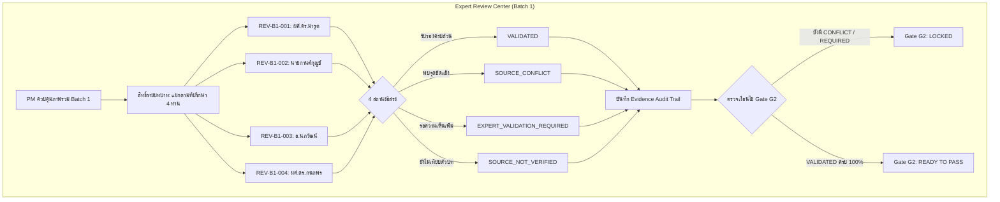

# Walkthrough: การปรับปรุง UX/UI ธีมสว่าง และสร้างระบบ Expert Review Center (Batch 1)

ระบบได้รับการปรับปรุง UX/UI แดชบอร์ดเป็น **ธีมสว่าง (Light Theme)** ที่อ่านง่าย คมชัด และสวยงาม พร้อมสร้างโมดูล **Expert Review Center (Batch 1)** ที่ปฏิบัติตามกฎเหล็ก 5 ข้ออย่างเคร่งครัด

---

## 1. การเปลี่ยนแปลงที่ดำเนินการ (Key Deliverables)

### 1.1 ปรับปรุง UX/UI แดชบอร์ดเป็นธีมสว่าง (Executive Light Theme)
- **สถาปัตยกรรมสี**: ใช้สีพื้นหลังขาว/เทาอ่อน (`#FFFFFF`, `#F8FAFC`) ร่วมกับอัตลักษณ์องค์กร สกสว. — Deep Navy (`#062B63`), Brand Blue (`#1356A3`), Strategic Orange (`#F36C21`), และ Emerald Green (`#059669`)
- **การจัดวางข้อมูล**: เพิ่มความคมชัดและอ่านง่าย (High Readability) ในทุกองค์ประกอบ:
  - [dashboard.tsx](file:///e:/00.1_DenD3v_AI/69_DenD3v_12%29%20tsri-project/app/routes/dashboard.tsx) — ตาราง Recent Documents พร้อม Badge สถานะเอกสาร
  - [RoleWorkspaceView.tsx](file:///e:/00.1_DenD3v_AI/69_DenD3v_12%29%20tsri-project/app/components/dashboard/RoleWorkspaceView.tsx) — แถบสลับมุมมอง 5 บทบาท พร้อมข้อมูลจริง
  - [GateProgressBar.tsx](file:///e:/00.1_DenD3v_AI/69_DenD3v_12%29%20tsri-project/app/components/dashboard/GateProgressBar.tsx) — แถบความก้าวหน้า Gate G0–G6
  - [MetricCards.tsx](file:///e:/00.1_DenD3v_AI/69_DenD3v_12%29%20tsri-project/app/components/dashboard/MetricCards.tsx) — การ์ดสถิติ 4 มิติ (TOR Coverage, Deliverables, Gaps, RAID)
  - [ActionMeetingsPanel.tsx](file:///e:/00.1_DenD3v_AI/69_DenD3v_12%29%20tsri-project/app/components/dashboard/ActionMeetingsPanel.tsx) — งานด่วน, การประชุม, และ Activity Log

---

### 1.2 ระบบ Expert Review Center (Batch 1) ตามกฎเหล็ก 5 ข้อ

ไฟล์ที่พัฒนา: [routes/reviews.tsx](file:///e:/00.1_DenD3v_AI/69_DenD3v_12%29%20tsri-project/app/routes/reviews.tsx)

#### กฎข้อที่ 1: สิทธิ์ตามบทบาท (Role-Based Simulation)
- มีแท็บสลับมุมมองระหว่าง **PM / Control Tower View** (เห็นทั้ง Batch) กับ **มุมมองรายที่ปรึกษา** (ผศ.ดร.มารุต, นายกานต์กุญช์, อ.นภวัฒน์, ผศ.ดร.กนกพร)

#### กฎข้อที่ 2: 4 สถานะการตรวจสอบแยกขาดจากกัน (Distinct Verification States)
- `VALIDATED` (รับรองแล้ว - สีเขียว)
- `SOURCE_CONFLICT` (พบข้อขัดแย้ง - สีแดง)
- `EXPERT_VALIDATION_REQUIRED` (รอความเห็นผู้เชี่ยวชาญ - สีส้ม)
- `SOURCE_NOT_VERIFIED` (ยังไม่ได้เทียบตัวบท - สีเทา)

#### กฎข้อที่ 3: บันทึกผลตรวจแบบมีหลักฐาน (Evidence-backed Audit Trail)
- มี Modal Form บันทึกผลการตรวจทาน บังคับกรอก:
  1. มาตรา / ข้อ
  2. เลขหน้าในเอกสาร
  3. ฉบับ/แหล่งประกาศที่ใช้เทียบเคียง
  4. คำวินิจฉัย / เหตุผลทางกฎหมาย
  5. ผลกระทบต่อ TOR Requirements & Deliverables
  6. ไฟล์หลักฐานอ้างอิงผ่าน Cloudflare R2 Secure Storage

#### กฎข้อที่ 4: การรักษาเวอร์ชันเอกสาร (Immutable Versions)
- ป้องกันการเขียนทับเอกสาร v1.0 โดยผลการตรวจทานจะจัดเก็บเป็น Evidence Audit Record แยกเฉพาะ และเชื่อมโยงกับการยกร่างแก้ไขใหม่ (Draft Iteration)

#### กฎข้อที่ 5: Gate Cadence และ G2 Dependency Check
- มีแบนเนอร์ **Gate G2 Dependency Check** ตรวจสอบสถานะความพร้อมแบบ Real-time (บล็อกการผ่าน Gate G2 จนกว่า Batch 1 จะเป็น `VALIDATED` ครบ 100%)

---

### 1.3 Database Migration & Supabase RLS
- ไฟล์ Migration: [20260923000002_expert_review_batches_and_rls.sql](file:///e:/00.1_DenD3v_AI/69_DenD3v_12%29%20tsri-project/supabase/migrations/20260923000002_expert_review_batches_and_rls.sql)
- รองรับตาราง `review_batches`, `review_items`, `review_evidence_records`
- บังคับใช้ Row Level Security (RLS) และ Triggers คำนวณความคืบหน้าอัตโนมัติ

---

## 2. ผลการทดสอบและตรวจสอบ (Verification Results)

- **การ Build**: รัน `npm run build` ผ่านสมบูรณ์ (0 errors, 1694 modules transformed)
- **Type Safety**: อัปเดต TypeScript interfaces ใน [app/types/index.ts](file:///e:/00.1_DenD3v_AI/69_DenD3v_12%29%20tsri-project/app/types/index.ts) ครบถ้วน
- **Navigation & Links**: เชื่อมโยง Dashboard, Review Center, TOR, และ Document Center สมบูรณ์
