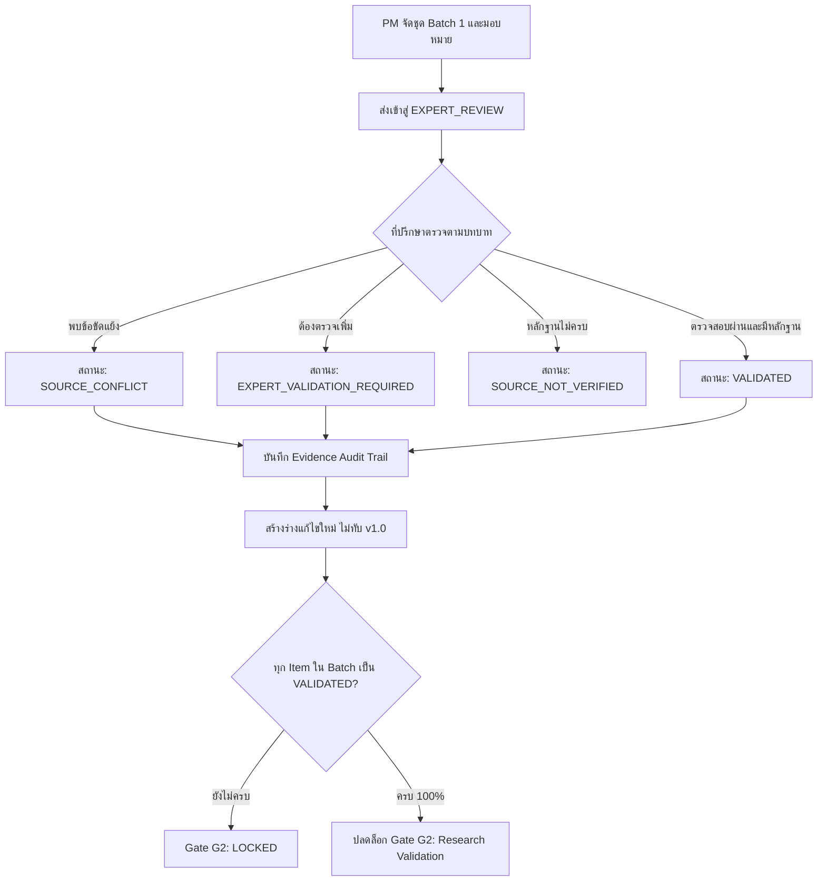

# แผนการพัฒนา: ระบบ Expert Review Center (Batch 1) และการบังคับใช้กฎความปลอดภัย RLS

เอกสารนี้สรุปผลการตรวจสอบโครงสร้างโปรเจกต์ปัจจุบัน (Repository, Database, Auth, Cloudflare R2, Routes) และกำหนดข้อกำหนดทางเทคนิค (Technical Specification) สำหรับการสร้าง **Expert Review Center (Batch 1)** ตาม 5 กฎเหล็กที่ระบุไว้

---

## 1. ผลการสำรวจโครงสร้างระบบปัจจุบัน (System Architecture & State Audit)

| องค์ประกอบ | รายละเอียดปัจจุบัน | สิ่งที่ต้องเพิ่มเติมสำหรับ Expert Review Center |
|---|---|---|
| **Database & Migrations** | Supabase PostgreSQL, มีตาราง `profiles`, `projects`, `tor_deliverables`, `documents`, `document_versions`, `meetings`, `activity_logs` พร้อม RLS เบื้องต้น | เพิ่มตาราง `review_batches`, `review_items`, `review_evidence_records` พร้อม Enum `verification_status` และ RLS Policies แบบ Role-based |
| **Auth & Permissions** | Supabase Auth พร้อม `user_role` ('project_admin', 'pm', 'researcher', 'legal_advisor', 'hrd', 'stakeholder', 'viewer') | เพิ่มเงื่อนไขสิทธิ์: PM จัดชุด/มอบหมาย, ที่ปรึกษาเห็นเฉพาะงานที่ได้รับมอบหมาย, ผู้มีอำนาจยืนยัน Gate |
| **Storage (Cloudflare R2)** | `app/lib/cloudflare-r2.server.ts` รองรับการสร้าง Signed URL เพื่ออัปโหลดและเข้าถึงไฟล์หลักฐานแบบ Secure | เชื่อมโยง R2 Storage Key กับ `review_evidence_records` เพื่อให้เข้าถึงไฟล์หลักฐานเฉพาะผู้มีสิทธิ์ |
| **Frontend & Routes** | Remix on Vite (`app/routes/reviews.tsx`), UI ธีมสว่างสอดคล้องกับ Dashboard | พัฒนาหน้าจอ `reviews.tsx` เต็มรูปแบบ: Batch 1 Package View, Role Filter, Evidence Audit Submission Form, และ G2 Gate Dependency Check |

---

## 2. กฎเหล็ก 5 ข้อที่ต้องล็อกก่อนเขียนฟังก์ชัน (Locked Architectural Rules)

### กฎข้อที่ 1: สิทธิ์ตามบทบาท (Role-Based Access Control)
- **PM / Project Director**: มีสิทธิ์สร้าง Review Batch, จัดชุดเอกสาร/ประเด็น, มอบหมายให้แก่ที่ปรึกษารายบุคคล, และติดตามความคืบหน้าภาพรวม
- **ที่ปรึกษา / ผู้เชี่ยวชาญ (Advisors)**: มองเห็นและบันทึกผลการตรวจทานได้เฉพาะรายการที่ตนเองได้รับมอบหมายเท่านั้น (Strict Assigned View)
- **เจ้าของทะเบียน (Document Custodian)**: ควบคุมการลงทะเบียนเอกสาร รหัสเอกสาร และการเปลี่ยนสถานะเวอร์ชัน
- **ผู้มีอำนาจ (Executive / Director)**: มีสิทธิ์ยืนยันการผ่าน Gate (G1 -> G2) และอนุมัติการเผยแพร่

### กฎข้อที่ 2: สถานะการตรวจสอบแยกขาดจากกัน (Distinct Verification States)
ห้ามรวมสถานะเป็น "เสร็จสิ้น" เดียวกัน โดยมี 4 สถานะมาตรฐาน:
1. `SOURCE_NOT_VERIFIED`: ยังไม่ได้ตรวจสอบกับตัวบทกฎหมาย/ระเบียบต้นทาง
2. `SOURCE_CONFLICT`: พบข้อขัดแย้งระหว่างตัวบทกฎหมายกับแนวปฏิบัติจริง หรือขัดแย้งกันระหว่างกฎหมายต่างลำดับศักดิ์
3. `EXPERT_VALIDATION_REQUIRED`: อยู่ระหว่างรอความเห็นทางวิชาการ/การตีความจากผู้เชี่ยวชาญเฉพาะด้าน
4. `VALIDATED`: ผ่านการตรวจรับรองความถูกต้องครบถ้วนและมีหลักฐานอ้างอิงชัดเจน

### กฎข้อที่ 3: บันทึกผลตรวจแบบมีหลักฐาน (Evidence-Backed Review Audit Trail)
ทุกการบันทึกคำตอบของผู้เชี่ยวชาญต้องเก็บข้อมูลบังคับครบถ้วน:
- **ผู้ตรวจ (Reviewer Profile & ID)**
- **วันเวลาที่ตรวจ (Timestamp)**
- **รหัสเอกสาร (DOC-ID & Version Number)**
- **มาตรา / ข้อ (Article / Section / Clause)**
- **เลขหน้า (Page Number)**
- **ฉบับที่ใช้เทียบเคียง (Edition / Promulgation Date)**
- **เหตุผลประกอบ (Rationale & Legal Reasoning)**
- **ผลกระทบต่อ REQ / ข้อกำหนดโครงการ (Impact on TOR Requirements)**
- **ไฟล์หลักฐานแนบ (Cloudflare R2 Evidence Storage Key)**

### กฎข้อที่ 4: การรักษาเวอร์ชันเอกสาร (Immutable Approved Versions)
- เอกสารหรือบทวิเคราะห์ที่สถานะเป็น `VALIDATED` (เช่น v1.0) จะถูกล็อกไม่ให้แก้ไขทับ (Immutable)
- เมื่อมีความเห็นปรับปรุงจากผู้เชี่ยวชาญ ระบบจะสร้างเวอร์ชันร่างใหม่ (เช่น v1.1 Draft) เพื่อดำเนินการแก้ไขตามรอบ

### กฎข้อที่ 5: Gate Cadence และ G2 Dependency Check
- งานสามารถจัดแพ็กเข้าสู่สถานะ `EXPERT_REVIEW` ได้ทันที
- แต่การอนุมัติผ่าน **Gate G2 (Research Validation)** จะต้องตรวจสอบว่าเอกสารและประเด็นใน Batch 1 ทุกรายการมีสถานะเป็น `VALIDATED` พร้อมหลักฐานครบ 100%

---

## 3. ข้อมูลจริงสำหรับ Expert Review Center — Batch 1 (สกสว.)

### ข้อมูลชุดตรวจ Batch 1: "การจัดหมวดหมู่กฎหมาย ลำดับศักดิ์ และอำนาจหน้าที่ตาม พ.ร.บ. ววน. และกองทุน ววน."
1. **REV-B1-001 (ผศ.ดร. มารุต)**: ขอบเขตอำนาจหน้าที่และการตัดสินใจของคณะกรรมการ กสว. และผู้บริหารระดับสูง สกสว. ตามมาตรา 58
2. **REV-B1-002 (นายกานต์กุญช์)**: การบริหารเงินกองทุน ววน. (FF vs SF) และข้อติดขัดการเบิกจ่ายตามระเบียบ กสว. 2563
3. **REV-B1-003 (อ.นภวัฒน์)**: ลำดับศักดิ์กฎหมาย พ.ร.บ. สภานโยบายฯ 2562 และ พ.ร.บ. แก้ไขเพิ่มเติม (ฉบับที่ 2) พ.ศ. 2568
4. **REV-B1-004 (ผศ.ดร.กนกพร)**: การบริหารการเงินพัสดุและข้อบังคับ สกสว. ว่าด้วยการเงินและการจัดซื้อจัดจ้าง

---

## 4. แผนการแก้ไขโค้ดรายไฟล์ (Proposed File Changes)

### Phase 1: Database Migration & Supabase RLS
#### [NEW] [20260923000002_expert_review_batches_and_rls.sql](file:///e:/00.1_DenD3v_AI/69_DenD3v_12%29%20tsri-project/supabase/migrations/20260923000002_expert_review_batches_and_rls.sql)
- สร้างตาราง `review_batches`, `review_items`, `review_evidence_records`
- สร้าง Trigger ป้องกันการเขียนทับและบันทึก Audit Logs
- กำหนด RLS Policies คุมสิทธิ์ PM, ที่ปรึกษา, และผู้มีอำนาจ

### Phase 2: TypeScript Data Models & Contract
#### [MODIFY] [types/index.ts](file:///e:/00.1_DenD3v_AI/69_DenD3v_12%29%20tsri-project/app/types/index.ts)
- เพิ่ม TypeScript Interfaces สำหรับ `ReviewBatch`, `ReviewItem`, `ReviewEvidenceRecord`, `VerificationStatus`
- อัปเดต `ExecutiveDashboardData` ให้เชื่อมโยง Review Center Metrics

#### [MODIFY] [lib/mock-data.ts](file:///e:/00.1_DenD3v_AI/69_DenD3v_12%29%20tsri-project/app/lib/mock-data.ts)
- เพิ่มชุดข้อมูลจริง Batch 1 พร้อมรายการตรวจทาน, ผู้เชี่ยวชาญที่ได้รับมอบหมาย, และสถานะทั้ง 4 แบบ

### Phase 3: Frontend Route & Interactive Components
#### [MODIFY] [routes/reviews.tsx](file:///e:/00.1_DenD3v_AI/69_DenD3v_12%29%20tsri-project/app/routes/reviews.tsx)
- หน้าจอ Expert Review Center ธีมสว่าง (Light Theme)
- ตัวสลับมุมมองบทบาท (PM View vs Expert Assigned View)
- ตารางรายการตรวจทาน Batch 1 แสดงสถานะ 4 สีชัดเจน
- ฟอร์มบันทึกผลการตรวจพร้อมหลักฐาน (Section, Article, Page, Edition, Rationale, Impact)
- แถบตรวจสอบความพร้อม Gate G2 Readiness Bar

---

## 5. แผนการทดสอบและตรวจสอบ (Verification Plan)

### การทดสอบความถูกต้อง
1. **การ Build**: รัน `npm run build` ตรวจสอบความถูกต้องของ TypeScript และ Vite bundling
2. **Role-based Simulation**: ทดสอบสลับ Role ระหว่าง PM (เห็นทั้ง Batch) กับ ที่ปรึกษา (เห็นเฉพาะงานที่ได้รับมอบหมาย)
3. **Evidence Submission**: ทดสอบการส่งฟอร์มผลตรวจ บันทึกข้อมูลและอัปเดตสถานะเป็น `VALIDATED`
4. **Gate G2 Block Check**: ตรวจสอบว่าระบบแจ้งเตือนบล็อก Gate G2 เมื่อยังมีรายการ `SOURCE_CONFLICT` หรือ `EXPERT_VALIDATION_REQUIRED` อยู่
